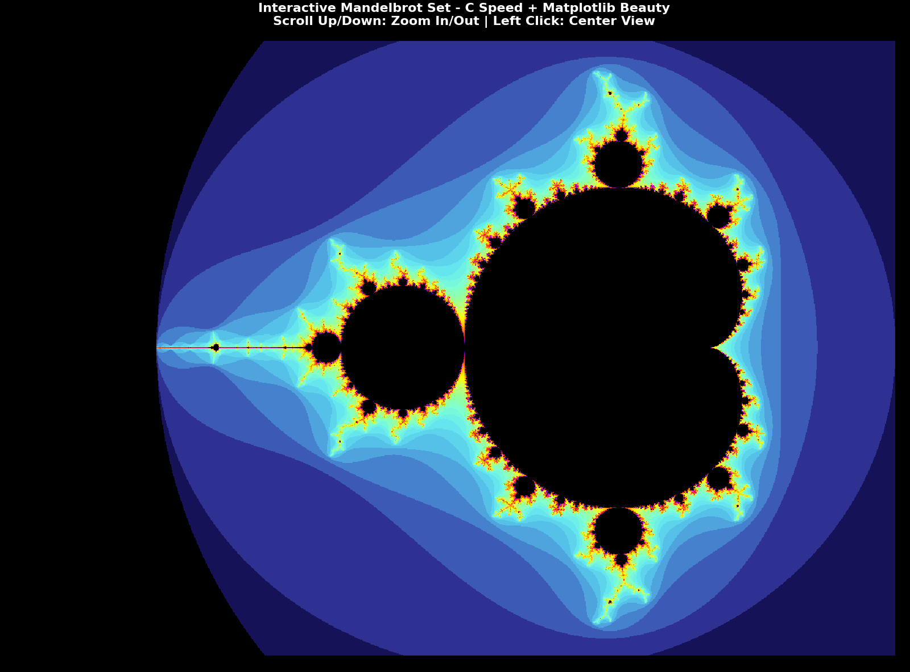

# Ultra-Fast Mandelbrot Set Explorer

High-performance fractal visualization combining C computation speed with Python
interactivity.

**Performance**: 20-40x faster than pure Python • 0.1-0.5 seconds per frame



## 🔧 Quick Start

1. **Run the interactive explorer**:

   ```bash
   python interactive_mandelbrot_fast.py
   ```

   _(C library already compiled as `mandelbrot_compute.dll`)_

## 🎮 Controls

- **Left Click** → Zoom in 3x at cursor
- **Right Click** → Zoom out 3x
- **Close Window** → Exit

## 📚 Documentation

- [Performance Benchmarks](docs/performance.md) - Speed comparisons and
  technical details
- [Future Optimizations](docs/optimizations.md) - Ideas for GPU, SIMD,
  multi-threading
- [Technical Guide](docs/technical.md) - Algorithm, compilation, color
  customization
