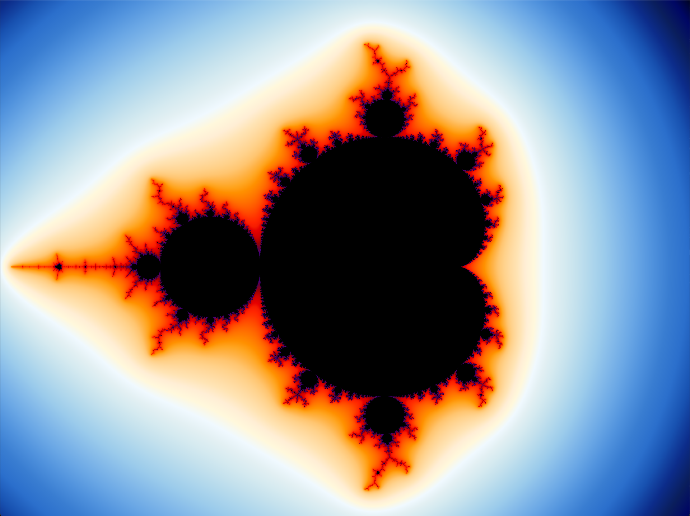
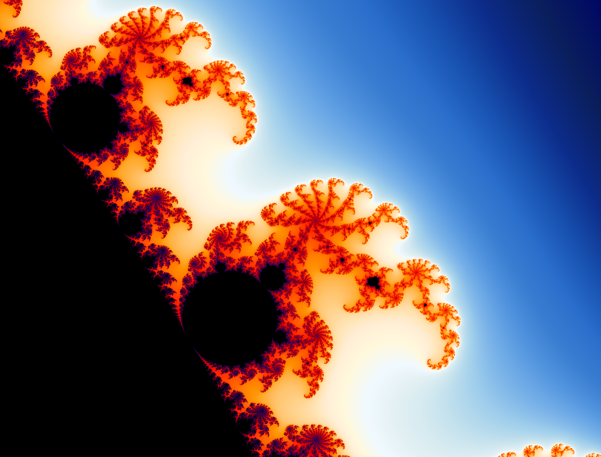
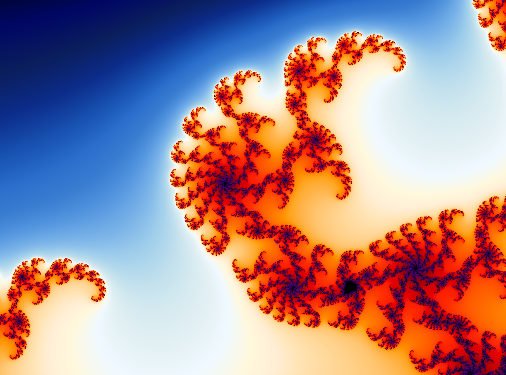

# High-Performance Mandelbrot Explorer


[🇺🇸 English](README.md) | [🇯🇵 日本語](docs/README_JP.md)

A state-of-the-art Mandelbrot Set explorer capable of real-time rendering at
extreme zoom levels ($> 10^{30}$). This project leverages **Perturbation
Theory**, **Series Approximation**, and **AVX2 SIMD** instructions to overcome
the limitations of standard floating-point arithmetic.

## 📸 Gallery

<p align="center">
  
  <br/>
  <em>Classic Mandelbrot Set with smooth coloring</em>
</p>

<p align="center">
  
  <br/>
  <em>Deep zoom revealing intricate fractal patterns</em>
</p>

<p align="center">
  
  <br/>
  <em>Extreme zoom demonstrating 128-bit precision capabilities</em>
</p>

**Recent optimizations** (Nov 2025) provide **1.5-2× speedup** through:

- Pre-cast reference orbit arrays (eliminates type conversion overhead)
- Hoisted SIMD constants (reduces register pressure)
- Aligned memory allocation (improves cache efficiency)

## 🚀 Features

- **Extreme Zoom**: Explore depths exceeding $10^{30}$ with perfect precision.
- **Hybrid Precision Engine**: Automatically switches between:
  - `double` (64-bit) for speed at shallow zooms.
  - `long double` (80-bit) for intermediate precision.
  - **Perturbation Theory** (128-bit reference + 64-bit delta) for deep zooms.
- **High Performance**:
  - **AVX2 Vectorization**: Processes 4 pixels per cycle.
  - **OpenMP Parallelism**: Multi-threaded rendering across all CPU cores.
  - **Series Approximation (BLA)**: Skips up to 80% of iterations in deep zooms.
- **Smooth Visualization**:
  - OpenGL-based rendering.
  - Continuous smooth coloring with dynamic histogram normalization.
  - Palette matching standard high-quality renderers.

## 🛠️ Installation & Usage

### Prerequisites

- **Python 3.x**
- **GCC** (with quadmath support) or equivalent C compiler
- **Python packages**: `glfw`, `PyOpenGL`, `numpy`, `matplotlib`

```bash
pip install glfw PyOpenGL numpy matplotlib
```

### Building

**Windows:**

```powershell
.\build.ps1
```

**Linux/Mac:**

```bash
chmod +x build.sh
./build.sh
```

### Running the Explorer

```bash
python src/smooth_mandelbrot.py
```

### Controls

- **Scroll Wheel**: Zoom in / out at cursor position.
- **Left Click**: Center the view at the cursor.
- **ESC**: Exit the application.

## 🔧 Technical Details

For a deep dive into the mathematics and optimization techniques used (including
Perturbation Theory and Bivariate Linear Approximation), please refer to:

- [Final Report](docs/FINAL_REPORT.md)
  ([🇯🇵 Japanese Version](docs/FINAL_REPORT_JP.md))
- [Optimization Guide](docs/OPTIMIZATIONS.md) - Details on recent performance
  improvements

### Performance Testing

```bash
# Run correctness tests
python tests/test_optimizations.py

# Run performance benchmarks
python tests/benchmark_optimizations.py
```

## 🚀 Performance

Typical rendering times on modern hardware:

- **Deep Zoom** (800×600, 2000 iterations): ~0.38s
- **Very Deep Zoom** (640×480, 5000 iterations): ~0.05s
- **Throughput**: 2.5-32 Giga-iterations/sec (depending on zoom level)

See [OPTIMIZATIONS.md](docs/OPTIMIZATIONS.md) for detailed benchmark results.

## 📄 License

This project is open source. Feel free to explore and modify.
